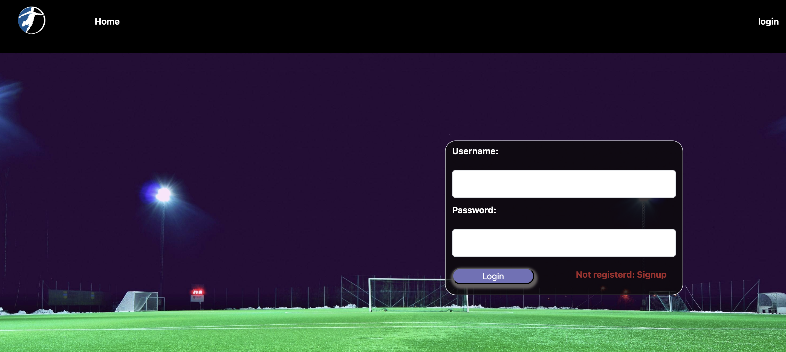
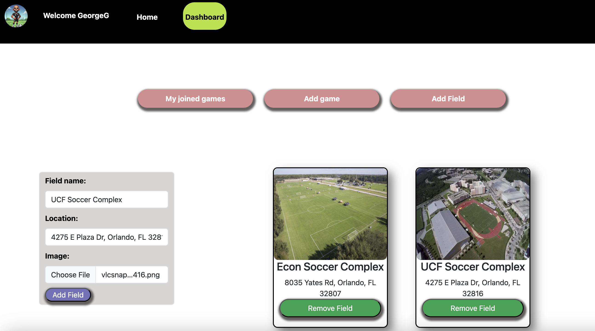
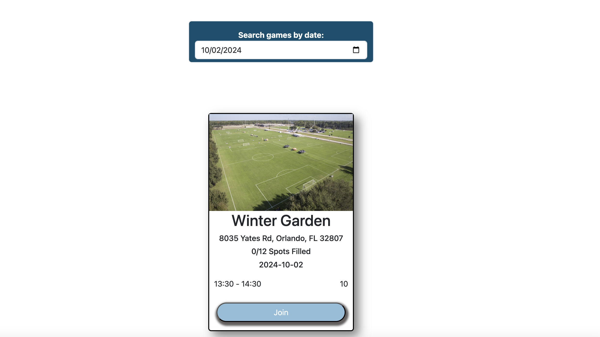

# FootyNet

## Description
FootyNet is a soccer-focused web app that connects players and field owners, making it easy to find and join local games. Whether you’re looking for a competitive match, informal practice, or want to list your own soccer field for others to use, FootyNet has you covered.

## Tabel of Contents

* [Description](#Description)
* [Screenshots](#Screenshots)
* [Installation](#Installation)
* [Usage](#Usage)
* [Contributions](#Contributions)
* [Test](#Test)
* [Questions](#Questions)

## Screenshots

Here are a few screenshots of FootyNet to showcase the interface and functionality:

### Login Page

### Add Field

### Search game by date

    
## Installation 
    To install the packages that were used in this project please run the following command from the root, client and server folders:
    npm install and npm run develop.

 ## Usage
   This is a full stack application, that can store data on database. The site requires you to signup with a username, email and password and an option to select a profile picture.

## Contributions
Please read the guideline provided in the github repo for the project

## Testing
There are not test available for this project

## Acknowledgements 

* Xpert Learning Assistant

## Links

## link for deployed applicatin:
    * https://footy-net.onrender.com/
## repo:
* https://github.com/ekhay-hit/footy_net

## Contributors:
    * https://github.com/Portillo1756
    * https://github.com/ekhay-hit
    * https://github.com/mjurek1
    * https://github.com/JGuzman87
   